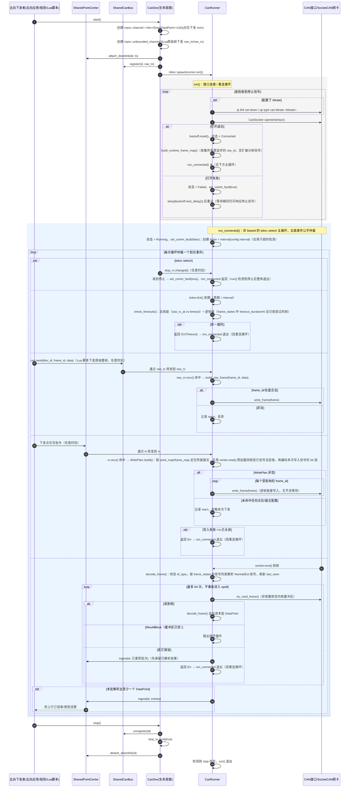

# CAN 读写时序图

本文档描述 `collector-core/src/dev/can_dev` 当前的收发调度机制，
对应代码：`device.rs`（生命周期 / 下行 channel 注册 / CAN 总线注册）、
`runner.rs`（接口连接管理 + 统一 `tokio::select!` 主循环调度 + 报文解析）、
`downlink.rs`（点位写计划构建：按信号编码进 CAN 报文）、`backoff.rs`
（重连指数退避）。

## 关键概念

| 概念 | 来源 | 含义 |
| --- | --- | --- |
| `interval` | 协议配置 | 超时检测 ticker 的周期；每次 tick 触发一次总线级 + 单帧级超时检查，不驱动读写本身（CAN 读写均由 socket 事件 / 下行 channel 事件驱动） |
| `timeout` | 协议配置 | 总线级超时：`last_rx_at` 距今超过该值，判定接口无通讯，触发重连 |
| `frame.timeout_duration` | 每个 CAN 帧配置 | 单帧级超时：该 `frame_id` 超过此时长未收到判定超时；配置为 0 表示不检测（用于下行专用帧，永远不会被接收到） |
| `bitrate` | 协议配置（可选） | 若配置，`connect()` 前会执行 `ip link set <iface> down` + `up type can bitrate <bitrate>` 初始化接口 |
| `raw_rx` / `SharedCanBus` | `can_bus.rs` | Lua `can.send()` 下发原始整帧的通道，与点位下发（`rx`）是两条独立路径，互不经过编码/解码 |
| 批量排空上限 = 64 | 常量 | 每次 `socket.next()` 命中后，不重新进入 epoll，直接用 `try_read_frame()` 连续读取内核缓冲区中已就绪帧，最多 64 帧，防止总线错误帧风暴独占工作线程 |
| `Backoff` | `backoff.rs` | 连接失败后的重试退避：初始 500ms，每次翻倍，上限 10s；连接成功后 `reset()` |

## 时序图

## 收发关键设计说明

1. **单一 `select!` 仲裁五路事件，但非 `biased`**：`run_connected` 用一个
   普通（非 `biased`）的 `tokio::select!` 循环仲裁停止信号、超时 ticker、
   Lua 原始帧下发（`raw_rx`）、点位写下发（`rx`）、CAN 帧接收
   （`socket.next()`）共五路。与 Modbus 的 `biased` 优先级仲裁不同，这里
   各分支被随机公平选中，不存在“写优先于读”之类的固定顺序保证。
2. **两条下行路径语义完全不同**：`raw_rx`（Lua `can.send()`）传输的是
   调用方自己拼好的原始整帧，`Runner` 只做 `frame_id`/长度合法性校验后
   直接透传写入；`rx`（点位下发，经 `SharedPointCenter`）传输的是具名
   点位值，需经 `WritePlan::build` 按信号的 `start_bit`/`bit_len`/
   `byte_order` 编码进所属报文的字节数组，且会先用 `center.read()`
   预加载同一报文里其它信号的当前值，避免整帧其它字段被写成 0。
3. **写入无节流等待**：与 Modbus 的 `write_interval` 不同，CAN 侧
   `WritePlan::apply` 对每个受影响的 `frame_id` 直接连续 `write_frame`，
   不在两次写入之间插入等待，写入延迟只取决于总线本身。
4. **超时判定分两级**：总线级由 `last_rx_at` 与 `config.timeout` 比较，
   衡量“接口是否完全无通讯”；单帧级由每个 `frame_id` 的
   `frame.timeout_duration` 控制，`0` 表示不检测（通常用于只发不收的
   下行专用帧），且从未被接收过的帧（`last_seen == None`）也跳过检测，
   避免刚连接时尚未收到首帧就被判超时。两级超时检查都挂在
   `interval` 周期的 `ticker.tick()` 分支上，而非每次收帧后单独判断。
5. **收帧批量排空，非重入 epoll**：`socket.next()` 命中一帧后，`Runner`
   不会立即让出去重新等待下一次 `select!`，而是在原地用
   `try_read_frame()` 连续非阻塞读取内核缓冲区中已就绪的帧（上限 64
   帧/批），解析结果累积为一批后一次性 `ingest`，减少总线突发流量下的
   调度次数；命中 `WouldBlock` 才跳出排空循环，交还 `select!` 继续仲裁。
6. **故障判定与重连**：接口打开失败、总线级/单帧级超时、读帧出错、
   点位写入失败、下行 channel 关闭，均会使 `run_connected` 返回
   `Err`（或提前 `return Ok`），触发 `set_comm_fault(true)` 并回到 `run()`
   的指数退避重连循环（`Backoff`：初始 500ms，倍增，上限 10s；连接
   成功即 `reset`）。
