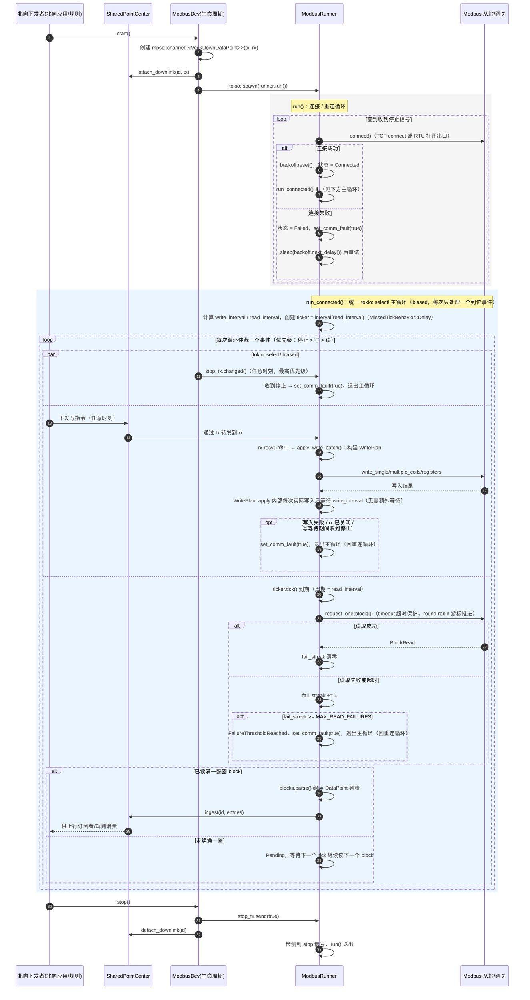

# Modbus 读写时序图

本文档描述 `collector-core/src/dev/modbus_dev` 当前的读写调度机制，
对应代码：`device.rs`（生命周期 / 下行 channel 注册）、`runner.rs`
（连接管理 + 统一 `tokio::select!` 主循环调度）、`block.rs`（分块读取 /
解析）、`downlink.rs`（写计划构建与下发）。

## 关键概念

| 概念 | 来源 | 含义 |
| --- | --- | --- |
| `timeout` | 协议配置 | 单次 Modbus 请求（读/写）的超时时间 |
| `request_interval` | 协议配置 | 写相关等待的固定间隔（`write_interval`，下限 1ms），**不随 block 数增长**；`WritePlan::apply` 内部每次实际写入之后都会等待一个该间隔 |
| `interval` | 协议配置 | 大循环轮询间隔；`== 0` 时读节拍间隔 `read_interval` 退化为 `write_interval`；`!= 0` 时按 block 数均分得到 `read_interval`（下限 1ms），使一整轮读取总耗时贴近配置值，避免随 block 数线性放大导致 CPU 占用过高 |
| `MAX_READ_FAILURES` | 常量 = 3 | 连续读取失败/超时达到该阈值即判定连接不可用，触发重连 |
| `ticker` | `time::interval(read_interval)` | 驱动读节拍的定时器，`MissedTickBehavior::Delay`：某次写入耗时较长导致错过 tick 时，不会在写完后瞬间“追帧”爆发式补读，而是顺延到下一个正常间隔 |

## 时序图

## 读写关键设计说明

1. **单一 `select!` 仲裁，读写共用同一条连接**：`run_connected` 用一个
   `biased` 的 `tokio::select!` 循环仲裁三路事件——停止信号、下行写命令
   （`rx.recv()`）、读节拍（`ticker.tick()`）。`biased` 保证优先级为
   停止 > 写 > 读，与原先“先排空写队列、再读一个 block”的语义等价，
   但去掉了手写的“先 try_recv 排空、再等待”状态机，逻辑更直观。
2. **写延迟与 block 数解耦**：写相关等待统一使用 `write_interval`
   （= `request_interval`，下限 1ms），不随 block 数量增长；`WritePlan::apply`
   内部每次实际写入之后都会等待一个 `write_interval`，无需在 `run_connected`
   里再额外等待。
3. **写命令不会被读节拍阻塞**：因为写命令走的是 `rx.recv()` 这一路
   `select!` 分支，一旦到达会立即被仲裁到并处理，不需要等 `ticker` 的下一次
   tick，写响应延迟因此始终 ≤ `write_interval`，与 `interval`/block 数无关。
4. **读间隔按需均分，用 `ticker` 驱动**：`interval == 0` 时 `read_interval`
   退化为 `write_interval`（等价于旧逻辑，仅防止忙等占满单核）；`interval != 0`
   时按 block 数均分为 `read_interval`，使一整轮读取的总耗时贴近配置值，
   而不是随 block 数线性放大，从而降低整体 CPU 占用。`ticker` 使用
   `MissedTickBehavior::Delay`：如果某次写入耗时较长错过了一个 tick，
   不会在写完后瞬间连续补读多次，而是顺延到下一个正常节拍。
5. **故障判定与重连**：单个 block 连续读取失败（含超时）达到
   `MAX_READ_FAILURES`（3 次），或写入失败、下行 channel 关闭，都会
   置位通讯故障并退出 `run_connected`，回到 `run()` 的指数退避重连循环。
