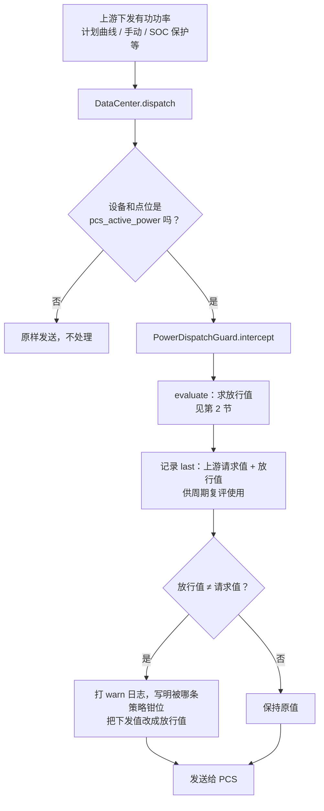
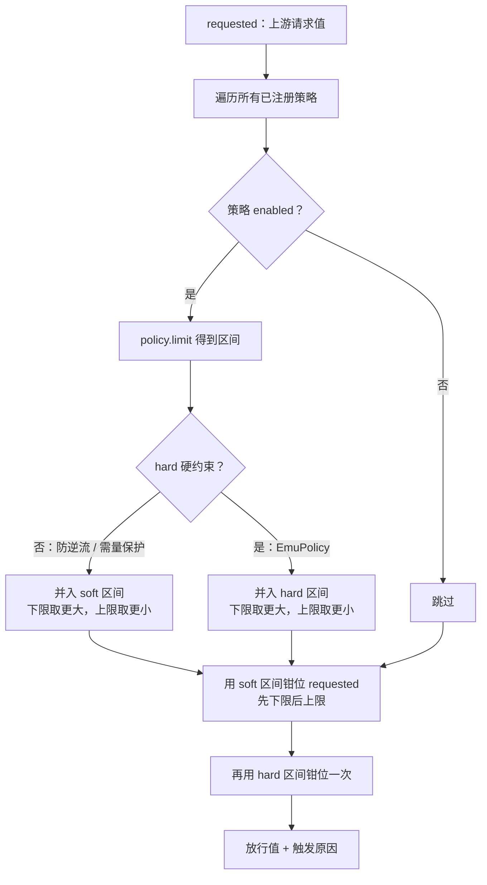
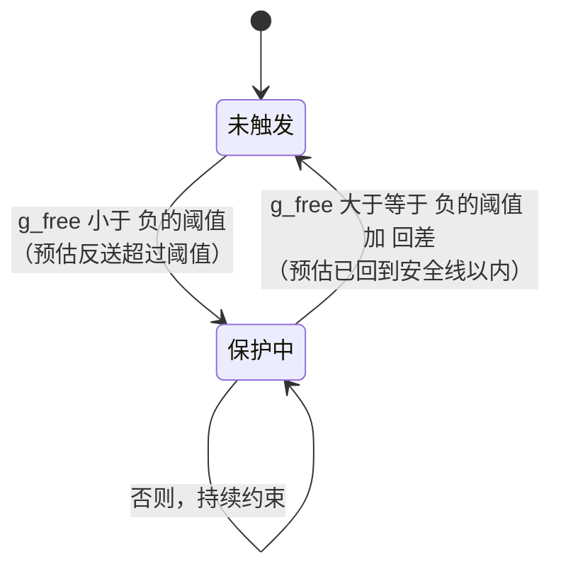
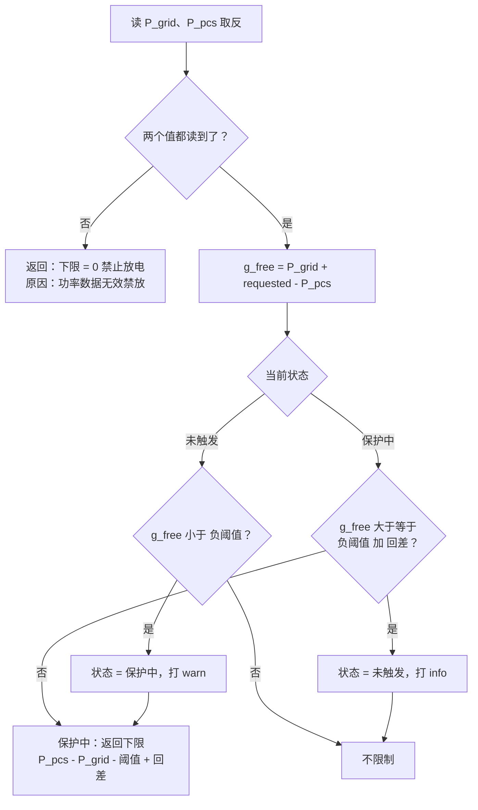
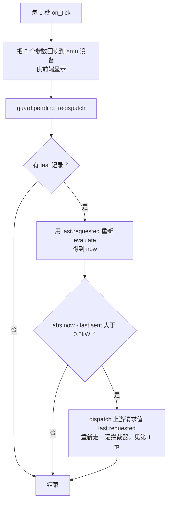
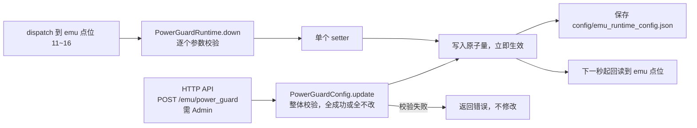
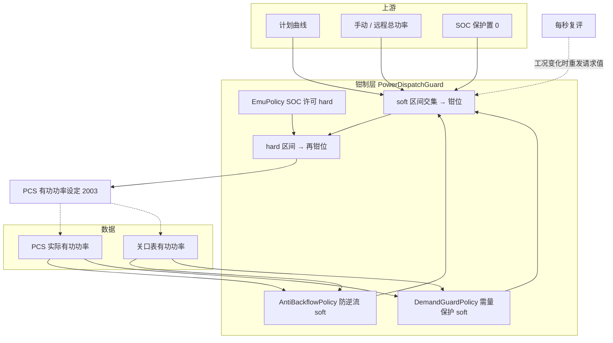

# 有功功率钳制流程

对应代码：`src/emu/power_guard.rs`（策略与守卫）、`src/emu/guard_runtime.rs`（参数点位与周期复评）、`src/emu/core.rs`（注册）。

一句话概括：**任何往 PCS 有功功率设定点（2003）下发的值，在真正发出去之前，都会被所有启用的"限制策略"各自算出一个允许区间，取交集后把值钳进去。**

---

## 0. 先统一符号（最容易看晕的地方）

| 量 | 含义 | 正 | 负 |
|---|---|---|---|
| 2003 下发值 `P_set` / 请求值 `requested` | PCS 有功功率设定 | **充电** | **放电** |
| `pcs_actual_power` 点位 | PCS 实际有功功率 | **放电** | **充电** |
| `grid_active_power` 点位 | 关口表有功功率 | **从电网取电** | **向电网反送** |

注意 `pcs_actual_power` 点位和 2003 口径**相反**，所以代码读取时先取反（`read_pcs_power`），之后文中的 `P_pcs` 都是**取反后**的值，口径与 2003 一致（正充负放）。

关口功率与 PCS 的关系：PCS 多充 1kW，电网就多供 1kW。因此调整 PCS 功率后，关口功率的预估为：

```
g_after = P_grid + (P_set - P_pcs)
```

- `P_grid`：关口表当前值
- `P_pcs`：PCS 当前实际功率（正充负放口径）
- `P_set`：准备下发的值

不限制时的预估值（按上游请求值下发）记作 `g_free = P_grid + (requested - P_pcs)`。

---

## 1. 总流程：一次下发经过了什么



关键点：
- 拦截器**只在有下发时才执行**。上游如果只下发一次，之后负荷变化它不会自己动，所以才需要第 5 节的周期复评。
- 记录的是**钳位前**的请求值，不是放行值。这样限制解除后能恢复到上游本来想要的功率。

---

## 2. 钳制核心：多条策略如何合并

每条策略只回答一个问题："这次允许的功率范围是多少？"，返回 `[下限, 上限]`，任意一端可以不设限。



三个规则：

1. **取交集**：多条策略的下限取最大、上限取最小，所以和注册顺序无关。
2. **硬约束最后钳**：`EmuPolicy`（SOC 导致的禁充/禁放）是设备安全，永远有最终话语权。例如需量保护想强制放电，但 SOC 已经到下限禁放，结果就是不放（0）。
3. **区间矛盾时上限优先**：如果防逆流要求 `>= 25`，需量保护要求 `<= 5`，结果是 5，也就是需量保护赢。

### EmuPolicy 的区间（硬约束）

| EMU 许可 | 区间 | 含义 |
|---|---|---|
| Normal | 不设限 | |
| ChargeDisabled 禁充 | `<= 0` | 不能为正（充电） |
| DischargeDisabled 禁放 | `>= 0` | 不能为负（放电） |
| TotalStop 禁充禁放 | `= 0` | |

---

## 3. 防逆流（AntiBackflowPolicy）

**目标**：反送电网的功率不超过「阈值」。靠限制放电（必要时强制充电）来做到。

**参数**：`阈值`（>= 0，0 即零逆流）、`回差`（> 0）。

### 3.1 状态机



### 3.2 每次计算



### 3.3 下限是怎么来的

我们希望调整后关口功率 `g_after >= -阈值 + 回差`（比触发线再留出一个回差的余量）。代入 `g_after = P_grid + (P_set - P_pcs)`，解得：

```
P_set >= P_pcs - P_grid - 阈值 + 回差
```

### 3.4 数字例子（阈值 0，回差 2）

PCS 正在放电 50kW（`P_pcs = -50`），关口反送了 10kW（`P_grid = -10`），上游请求继续放 50kW：

- `g_free = -10 + (-50 - (-50)) = -10 < 0`，触发
- 下限 `= -50 - (-10) - 0 + 2 = -38`
- 请求 -50 被钳到 **-38**（只放 38kW）
- 验证：`g_after = -10 + (-38 - (-50)) = +2`，关口回到取电 2kW，满足回差线

之后负荷回升，`g_free >= 2` 时释放，请求值 -50 重新放行。

### 3.5 为什么要回差

不加回差的话，调整后关口功率正好踩在触发线上，一点扰动就会反复进出保护，PCS 功率来回跳。回差让"触发线"和"释放线"之间留出一段缓冲：触发后把目标拉到回差线内侧，释放判断也用同一条线，所以释放时功率不会突变。

---

## 4. 需量保护（DemandGuardPolicy）

**目标**：从电网取电的功率不超过「需量限制」。靠限制充电（必要时强制放电）来做到。

**参数**：`需量限制`（> 回差）、`回差`（0 < 回差 < 需量限制）。

与防逆流是镜像关系：

| | 防逆流 | 需量保护 |
|---|---|---|
| 触发 | `g_free < -阈值` | `g_free > 限制` |
| 释放 | `g_free >= -阈值 + 回差` | `g_free <= 限制 - 回差` |
| 保护中给出 | **下限** `P_pcs - P_grid - 阈值 + 回差` | **上限** `P_pcs - P_grid + 限制 - 回差` |
| 数据读不到 | 禁止放电（保守） | **不限制**，只记日志（锁死充电代价更大） |

### 数字例子（限制 100，回差 5）

关口取电 110kW，PCS 静置（`P_pcs = 0`），请求 0：

- `g_free = 110 > 100`，触发
- 上限 `= 0 - 110 + 100 - 5 = -15`
- 请求 0 被钳到 **-15**（强制放电 15kW）
- 验证：`g_after = 110 + (-15 - 0) = 95 = 限制 - 回差`

目前按瞬时功率判断。电网实际按 15 分钟滑窗平均计量需量，滑窗预测留作后续扩展。

---

## 5. 周期复评（guard_runtime，每秒一次）

**要解决的问题**：拦截器只在有下发时才算。比如上游下发一次 -50kW，被防逆流钳到 -38；之后负荷升高，已经可以放 -50 了，但没有人再下发，PCS 就会一直停在 -38。反过来，负荷降低导致又要逆流，也没有人去收紧。



要点：
- 重发的是**上游请求值**，不是放行值。再经过拦截器后，会按最新工况重新钳位，并更新 `last`。
- 0.5kW 死区：工况没变就不重复向 PCS 写同一个值。
- 因此保护是**随关口功率实时跟随的**，限制解除后也会自动回到上游本来想要的功率。

---

## 6. 参数的修改与保存

参数存放在 `collector-core` 的 `RuntimeEmu.power_guard`（`PowerGuardConfig`），api 和 engine 共用同一份，有两个修改入口：



HTTP 接口：

| 方法 | 路径 | 权限 | 说明 |
|---|---|---|---|
| GET | `/v1/emu/power_guard` | 已登录 | 返回 6 个参数 |
| POST | `/v1/emu/power_guard` | Admin | 字段均可选，只改传入的；返回修改后的全部参数 |

请求体字段：`anti_backflow_enable`、`anti_backflow_threshold`、`anti_backflow_hysteresis`、`demand_guard_enable`、`demand_limit`、`demand_hysteresis`。

| 点位 ID | key | 含义 | 校验 |
|---|---|---|---|
| 11 | `anti_backflow_enable` | 防逆流使能 | 非 0 即开 |
| 12 | `anti_backflow_threshold` | 防逆流功率阈值 kW | `>= 0` |
| 13 | `anti_backflow_hysteresis` | 防逆流功率回差 kW | `> 0` |
| 14 | `demand_guard_enable` | 需量保护使能 | 非 0 即开 |
| 15 | `demand_limit` | 需量限制 kW | `> 需量回差` |
| 16 | `demand_hysteresis` | 需量功率回差 kW | `0 < 回差 < 需量限制` |

两个保护默认都是**关闭**的。

---

## 7. 用到的外部字段（需要绑定真实点位）

字段通过 `field_registry` 解析，可在字段绑定页改绑，不需要改代码。

| 字段 key | 方向 | 当前默认 | 说明 |
|---|---|---|---|
| `pcs_active_power` | 写 | pcs / 2003 | 被钳制的目标点 |
| `grid_active_power` | 读 | grid_meter / **9999（占位）** | 关口表有功功率，取电正反送负 |
| `pcs_actual_power` | 读 | pcs / **9999（占位）** | PCS 实际有功功率，**负充正放** |

读取目前只支持**按点位 ID 绑定**的字段（`read_field` 通过 `PointReader` 读，不支持 Key/Name 引用）。

---

## 8. 一张图看全局



虚线表示反馈：PCS 功率变化会影响关口表和 PCS 实际功率读数，下一轮计算会用到新的读数。
